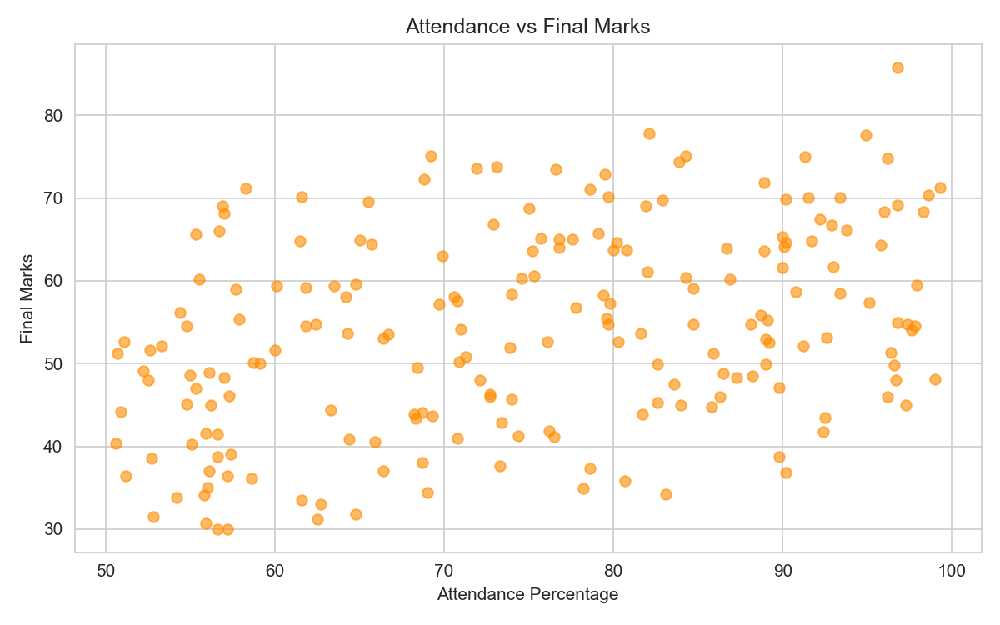
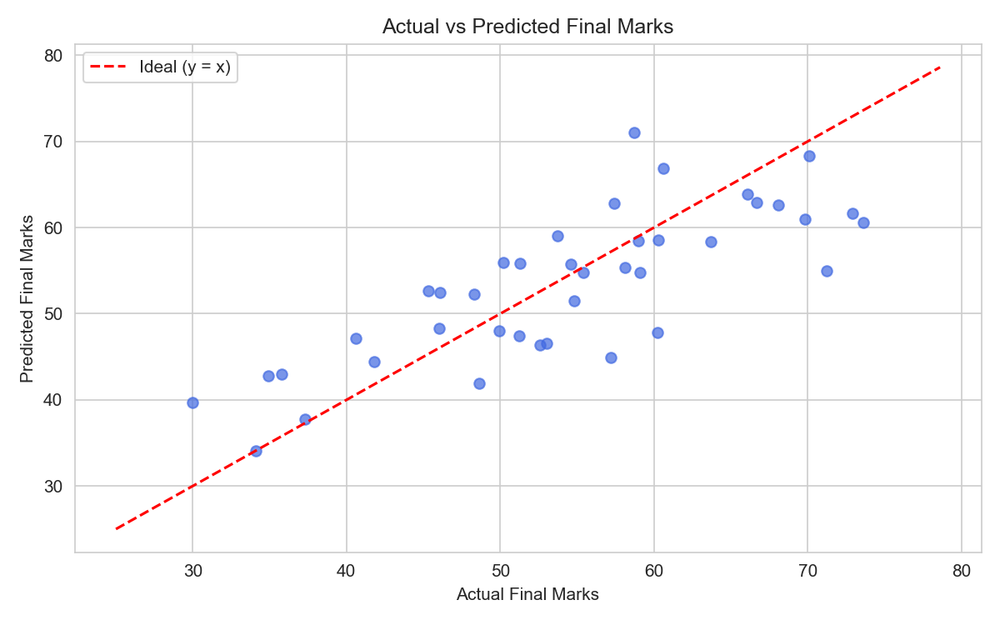
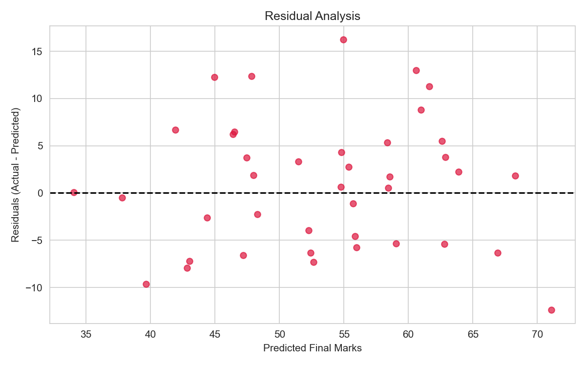
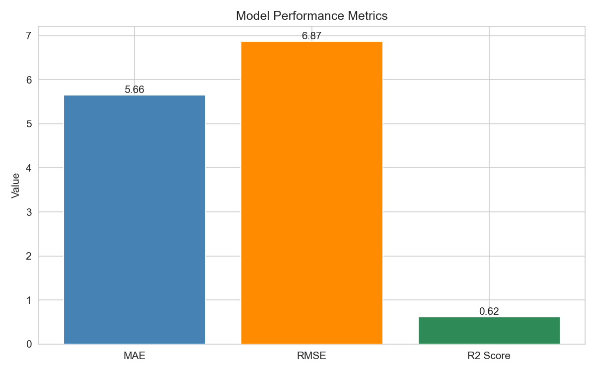

# EduPredict
## Student Performance Prediction Using Linear Regression

## 1. Abstract

EduPredict is a Machine Learning project that predicts a student's final examination marks from three academic factors: study hours per day, attendance percentage, and previous/internal marks. The project uses the Linear Regression algorithm from scikit-learn, which is part of the prescribed Machine Learning syllabus. The dataset contains 200 student records and is divided into 160 training samples and 40 testing samples (80/20 split, random_state = 42). The trained model achieved a Mean Absolute Error of 5.6561, Mean Squared Error of 47.1436, Root Mean Squared Error of 6.8661, and an R² score of 0.6206 on the test data. These results show that Linear Regression gives a reasonable and easily interpretable estimate of student performance.

## 2. Introduction

Machine Learning is a branch of Artificial Intelligence where computers learn patterns from data and use them to make predictions, instead of being programmed for every situation manually.

Our project comes under **supervised learning**, because the training data already contains the correct answers (the final marks). When the thing we want to predict is a continuous number, the supervised learning task is called **regression**. Predicting final exam marks is therefore a regression problem.

Predicting student performance is useful: if we can estimate how a student is likely to perform, teachers can provide support early to students who may be at risk.

Linear Regression is suitable for this project because the relationship between marks and factors like study hours, attendance, and previous marks is approximately linear, and the algorithm is simple, fast, and easy to interpret.

## 3. Problem Statement

The objective is to develop a machine learning model that predicts final student marks based on study hours, attendance percentage, and previous marks using Linear Regression.

## 4. Objectives

1. Prepare a realistic dataset of 200 student records.
2. Clean the data and verify there are no missing or duplicate issues.
3. Explore the data using graphs and correlation analysis.
4. Train a Linear Regression model on 80% of the data.
5. Predict final marks for the 20% test data and evaluate the model.

## 5. Proposed System

The proposed system takes study hours, attendance percentage, and previous marks as input, processes them through a trained Linear Regression model, and outputs the predicted final marks. All predictions are produced by the trained model itself; nothing is manually entered.

## 6. Dataset Description

| Feature | Description |
|---|---|
| Study Hours | Average study hours per day |
| Attendance Percentage | Student attendance |
| Previous Marks | Previous/internal marks |
| Final Marks | Final examination marks (target) |

- Dataset size = 200 records
- 4 columns, all numeric (float)
- No missing values, no duplicate rows
- Realistic ranges: Study Hours approx. 1–10, Attendance approx. 50–100, Previous Marks approx. 30–95, Final Marks approx. 30–100
- The dataset has natural variation/noise, so the model is not artificially perfect.

## 7. Features

### Study Hours
Average daily study time. More study is generally associated with higher marks.

### Attendance Percentage
Percentage of classes attended. Higher attendance usually improves performance.

### Previous Marks
Marks from earlier exams/internal assessments. Strongly related to future marks.

**Target variable:** Final_Marks

## 8. Machine Learning Algorithm

**Linear Regression** is the only algorithm used in this project (`sklearn.linear_model.LinearRegression`).

```
Final_Marks = Intercept + Study_Hours coefficient × Study_Hours
                        + Attendance coefficient × Attendance
                        + Previous_Marks coefficient × Previous_Marks
```

Using the actual values from the trained model:

```
Final_Marks = -0.3966 + 1.1695 × Study_Hours + 0.3000 × Attendance + 0.4084 × Previous_Marks
```

- **Intercept (b0) = -0.3966** — the predicted marks when all features are zero.
- **Coefficients (b1, b2, b3)** — how much the predicted marks change when that feature increases by 1 unit, keeping the other two constant.
- **Independent variables:** Study Hours, Attendance Percentage, Previous Marks.
- **Dependent variable:** Final Marks.
- The training process finds the best-fit straight-line relationship by minimizing the sum of squared prediction errors (least squares).
- Prediction applies this learned equation to new inputs.

## 9. Linear Regression Theory

Linear Regression models a linear relationship between inputs and a numeric output. For multiple features it is called multiple linear regression. The least-squares method chooses the intercept and coefficients that minimize the sum of the squares of the differences between actual and predicted values. Scikit-learn implements this for us, so we train the model with `model.fit(X_train, y_train)`.

## 10. Methodology

```
Dataset
  ↓
Data Preprocessing
  ↓
Exploratory Data Analysis
  ↓
Feature Selection
  ↓
Train-Test Split
  ↓
Linear Regression Training
  ↓
Prediction
  ↓
Evaluation
  ↓
Visualization
  ↓
Conclusion
```

## 11. Data Preprocessing

- Checked for missing values: **0 found**
- Checked for duplicate records: **0 found**
- Checked value ranges: all realistic
- No rows needed to be removed; no encoding needed because all features are numeric
- Train-test split: 80% training (160 samples), 20% testing (40 samples), `random_state = 42`

## 12. Exploratory Data Analysis

### Study Hours vs Final Marks


A positive trend is present but with noticeable spread.

### Attendance vs Final Marks



Higher attendance generally corresponds to higher marks.

### Previous Marks vs Final Marks


The strongest positive relationship among the three features.

### Correlation Heatmap


All three features are positively correlated with Final_Marks; Previous_Marks is the strongest.

### Distribution of Final Marks


Final marks vary roughly from 30 to 86, centered in the mid-50s.

## 13. Model Training

The `LinearRegression` model was trained using only the 160 training samples with `model.fit(X_train, y_train)`. Predictions for the 40 test samples were then generated with `model.predict(X_test)`.

## 14. Model Evaluation

All values below are the actual outputs of the executed code.

| Metric | Result |
|---|---:|
| MAE | 5.6561 |
| MSE | 47.1436 |
| RMSE | 6.8661 |
| R² Score | 0.6206 |

## 15. Results

- **MAE = 5.6561** — on average, predictions differ from actual marks by about 5.7 marks.
- **MSE = 47.1436** — average squared error; penalizes larger mistakes more.
- **RMSE = 6.8661** — typical error size in marks (~7 marks).
- **R² = 0.6206** — approximately 62% of the variation in final marks is explained by the three input features in this model. This should NOT be called "62% accuracy"; it is the proportion of variance explained.

## 16. Coefficients

| Feature | Coefficient |
|---|---:|
| Study Hours | 1.1695 |
| Attendance Percentage | 0.3000 |
| Previous Marks | 0.4084 |
| Intercept | -0.3966 |

Keeping the other features constant: each extra study hour/day is associated with about 1.17 more predicted final marks, each extra attendance percentage point with about 0.30 more, and each extra previous mark with about 0.41 more. All are positive, which matches the expected behaviour.

## 17. Sample Predictions

Actual values from `results/predictions/test_predictions.csv`:

| Actual Marks | Predicted Marks | Error |
|---:|---:|---:|
| 57.4 | 62.79 | -5.39 |
| 60.2 | 47.84 | 12.36 |
| 68.1 | 62.58 | 5.52 |
| 60.3 | 58.56 | 1.74 |
| 53.7 | 59.05 | -5.35 |
| 53.0 | 46.52 | 6.48 |
| 52.6 | 46.39 | 6.21 |
| 54.8 | 51.47 | 3.33 |
| 55.4 | 54.77 | 0.63 |
| 70.1 | 68.29 | 1.81 |

### Actual vs Predicted



Points lie around the ideal diagonal line, with some spread.

### Residual Plot



Errors are scattered around zero without an obvious pattern, which is reasonable for a linear model.

### Model Metrics Visualization



## 18. Discussion

The model performs reasonably for a simple linear approach. R² = 0.6206 means the three features explain roughly 62% of the variation in final marks. The remaining variation is due to factors not present in the dataset. The MAE and RMSE of around 6–7 marks are acceptable for an estimate but the model is not perfect — some student predictions are off by more than 10 marks. The Actual vs Predicted graph and residual plot support these conclusions.

## 19. Advantages

- Simple, fast, and easy to understand.
- Coefficients are directly interpretable.
- Good baseline regression model.

## 20. Limitations

- Dataset size is small (200 records).
- Only three main features are used.
- Linear Regression assumes a linear relationship.
- Student performance depends on many other factors (health, stress, environment, study quality).
- The dataset may not represent every student.

## 21. Future Scope

- Larger, real-world dataset.
- More features: assignment performance, sleep patterns, study consistency, previous semester performance.
- Comparison with other syllabus algorithms in future work.

## 22. Conclusion

EduPredict successfully implemented a complete ML workflow using Linear Regression to predict final exam marks. All coefficients were positive and meaningful, evaluation metrics were honest and reasonable (R² ≈ 0.62), and every result in this report comes from actual code execution.

## 23. References

1. Scikit-learn Documentation — Linear Models: https://scikit-learn.org/stable/modules/linear_model.html
2. Géron, A. — *Hands-On Machine Learning with Scikit-Learn, Keras, and TensorFlow*, O'Reilly.
3. Mitchell, T. M. — *Machine Learning*, McGraw-Hill.
4. Pandas Documentation: https://pandas.pydata.org/docs/
