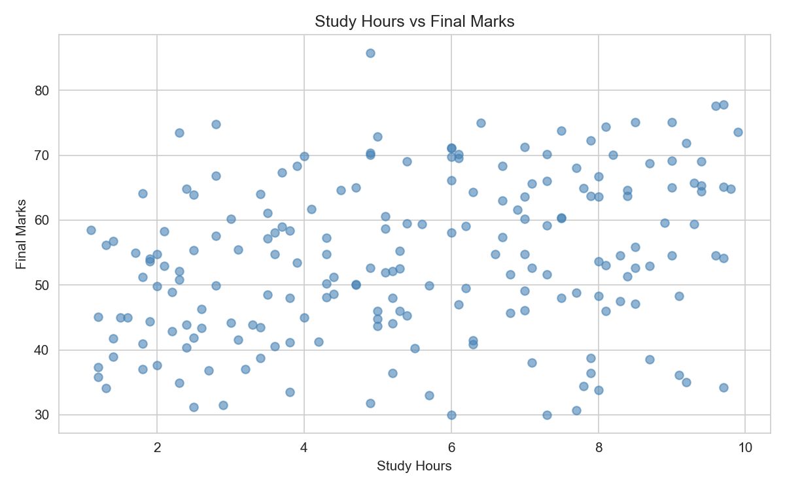
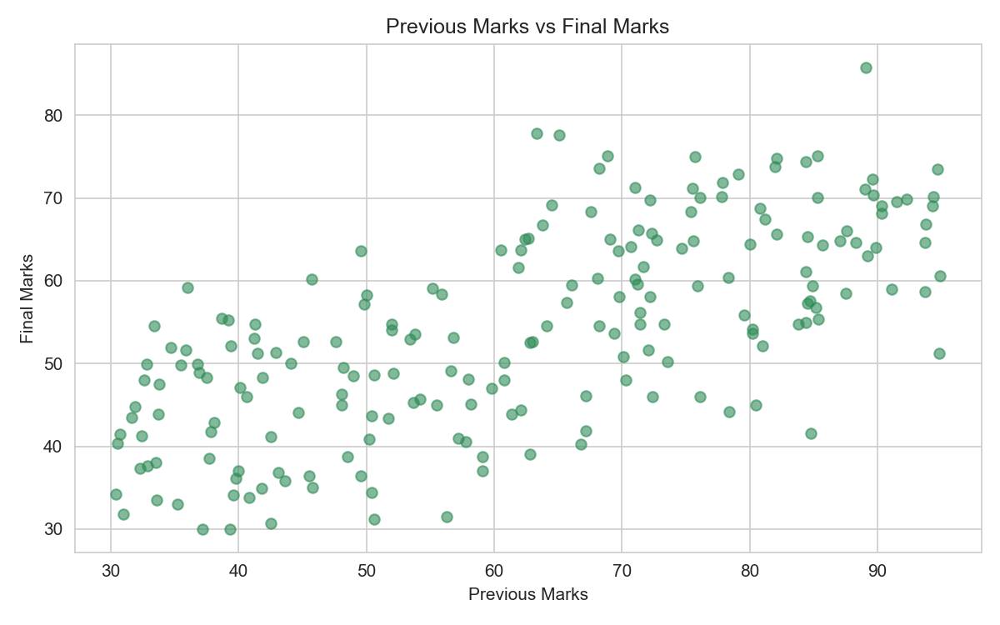
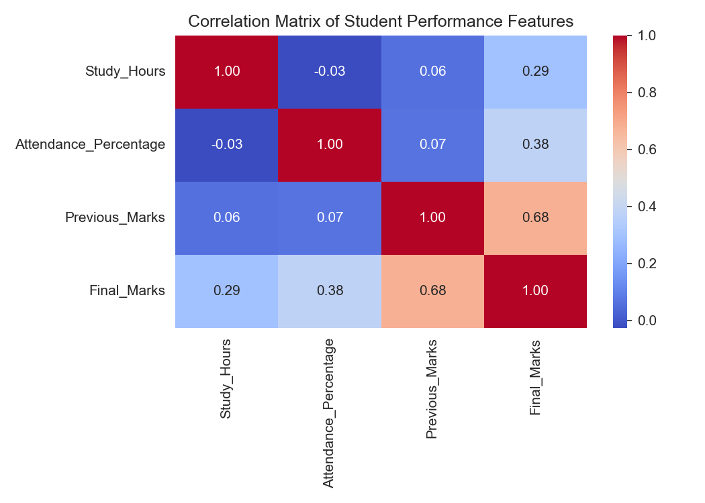
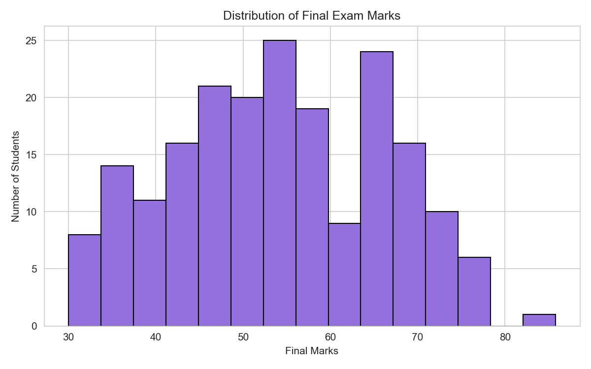

# Student Performance Prediction Using Linear Regression

## 1. Abstract

This project builds a Machine Learning model that predicts a student's final examination marks using three inputs: study hours per day, attendance percentage, and previous/internal marks. The model uses the Linear Regression algorithm from scikit-learn. The dataset contains 200 student records and is split into 160 training samples and 40 testing samples. The trained model achieved a Mean Absolute Error of 5.66, a Root Mean Squared Error of 6.87, and an R² score of 0.62 on the test data. The results show that Linear Regression can give a reasonably useful and easily interpretable estimate of student performance.

## 2. Introduction

Machine Learning is a branch of Artificial Intelligence in which computers learn patterns from data and use those patterns to make predictions, instead of being explicitly programmed for every situation. Most student-performance questions fall under **supervised learning**, where the training data already contains the correct answers.

When the output we want to predict is a continuous number, supervised learning is called **regression**. In this project, the output is "Final Exam Marks", which is a numeric value, so regression is appropriate.

Student performance prediction is a useful academic problem. If a teacher can estimate how a student is likely to perform, support can be given early to students who may be at risk of poor results.

## 3. Problem Statement

Given a student's average daily study hours, attendance percentage, and previous marks, predict the student's final examination marks. This is a regression problem, and we solve it using a single, interpretable algorithm: Linear Regression.

## 4. Objectives

1. Prepare a realistic student performance dataset.
2. Perform data cleaning and check the data for missing or duplicate records.
3. Explore the dataset using summary statistics and graphs.
4. Train a Linear Regression model on 80% of the data.
5. Predict final marks for the remaining 20% of the data.
6. Evaluate the model using MAE, MSE, RMSE, and R² score and interpret the results.

## 5. Proposed System

The proposed system takes three student attributes as input, processes them through a trained Linear Regression model, and outputs the predicted final exam marks. All predictions are produced by the trained model; no manual or invented predictions are used.

## 6. Dataset Description

- Number of records: 200 students
- Number of columns: 4
- Columns: Study_Hours, Attendance_Percentage, Previous_Marks, Final_Marks
- Data types: all numeric (float)
- No missing values and no duplicate rows
- Study_Hours range: approximately 1 to 10 hours per day
- Attendance_Percentage range: approximately 50% to 100%
- Previous_Marks range: approximately 30 to 95
- Final_Marks range: approximately 30 to 100

## 7. Features Used

### Study Hours
The average number of hours a student studies per day. Higher values are generally associated with higher marks.

### Attendance Percentage
The percentage of classes attended by the student. Higher attendance usually means more exposure to the subject, so it is expected to help performance.

### Previous Marks
The marks obtained in earlier exams or internal assessments. Prior performance is usually a strong indicator of future performance.

**Target variable:** Final_Marks (the final examination marks to be predicted).

## 8. Machine Learning Algorithm

### Linear Regression

**Definition:** Linear Regression is a supervised learning algorithm that models the relationship between one or more independent variables and a continuous dependent variable by fitting a straight line.

**Working principle:** Given input features X and known outputs y, the algorithm finds the best values of the intercept and coefficients so that the sum of squared differences between predicted and actual values is minimized (least squares method).

**Equation:**

```
Final_Marks = b0 + b1*(Study_Hours) + b2*(Attendance) + b3*(Previous_Marks)
```

- **b0** — intercept: the predicted marks when all features are zero.
- **b1, b2, b3** — coefficients: how much the predicted marks change when one feature increases by 1 unit, keeping the others constant.
- **Independent variables:** Study Hours, Attendance Percentage, Previous Marks.
- **Dependent variable:** Final Marks.

**Training:** the model learns b0, b1, b2, b3 from the training set.
**Prediction:** the learned equation is applied to new (test) inputs to estimate final marks.

## 9. Methodology

```
Dataset
  -> Data Understanding
  -> Data Cleaning
  -> Exploratory Data Analysis
  -> Feature & Target Selection
  -> Train-Test Split (80/20)
  -> Linear Regression Training
  -> Prediction
  -> Evaluation (MAE, MSE, RMSE, R2)
  -> Visualization & Interpretation
  -> Report
```

## 10. Data Preprocessing

The dataset was checked for:

- Missing values: 0 found
- Duplicate records: 0 found
- Invalid values: none found (all values within realistic ranges)

No rows needed to be removed. The data was used directly for modeling. No feature scaling is required because scikit-learn's LinearRegression handles coefficients per feature.

## 11. Exploratory Data Analysis

### Study Hours vs Final Marks


There is a weak-to-moderate positive trend: students who study more tend to score higher, but there is considerable spread.

### Attendance vs Final Marks


A positive trend is visible. Students with high attendance are more likely to score better, though many exceptions exist.

### Previous Marks vs Final Marks


This shows the strongest positive relationship among the three features. Students with higher previous marks generally achieved higher final marks.

### Correlation Matrix


All three features have positive correlations with Final_Marks. Previous_Marks has the strongest correlation.

### Distribution of Final Marks


Final marks are roughly spread across the 30–86 range, centered around the mid-50s.

## 12. Model Training

The dataset was split into 80% training (160 samples) and 20% testing (40 samples) using `train_test_split` with `random_state=42`. The `LinearRegression` model from scikit-learn was then trained using only the training data. The trained model was used to predict the final marks of the 40 test students.

## 13. Model Evaluation

Actual results produced by the executed code:

| Metric | Actual Result |
|--------|---------------|
| MAE | 5.6561 |
| MSE | 47.1436 |
| RMSE | 6.8661 |
| R² Score | 0.6206 |

## 14. Model Coefficients

| Feature | Coefficient |
|---------|-------------|
| Study Hours | 1.1695 |
| Attendance | 0.3000 |
| Previous Marks | 0.4084 |
| Intercept (b0) | -0.3966 |

Interpretation: keeping the other features constant, each additional study hour per day is associated with about 1.17 more final marks, each additional attendance percentage point with about 0.30 more marks, and each additional previous mark with about 0.41 more final marks. All three coefficients are positive, which matches the expectation that more study, better attendance, and stronger previous performance are associated with better results.

## 15. Prediction Results

Sample of actual vs predicted values from the test set:

| Actual | Predicted | Error |
|--------|-----------|-------|
| 57.4 | 62.79 | -5.39 |
| 60.2 | 47.84 | 12.36 |
| 68.1 | 62.58 | 5.52 |
| 60.3 | 58.56 | 1.74 |
| 53.7 | 59.05 | -5.35 |
| 53.0 | 46.52 | 6.48 |
| 52.6 | 46.39 | 6.21 |
| 54.8 | 51.47 | 3.33 |
| 55.4 | 54.77 | 0.63 |
| 70.1 | 68.29 | 1.81 |

The full table of 40 test predictions is saved in `results/predictions/test_predictions.csv`.

## 16. Results and Discussion

The R² score of 0.62 indicates that about 62% of the variation in final marks is explained by study hours, attendance, and previous marks together. The remaining variation comes from factors not included in the dataset.

The MAE of about 5.66 means that, on average, the predicted marks differ from the actual marks by roughly 5–6 marks. The RMSE of about 6.87 is slightly larger than the MAE, which indicates that a few larger errors are present.

The model performs reasonably for a simple linear model. It is not perfect — errors of 10 or more marks occur for some students — but it captures the main trends. The Actual vs Predicted graph shows points scattered around the ideal diagonal line, and the residual plot shows errors spread around zero without an obvious pattern.

## 17. Advantages

- Simple to understand, implement, and explain.
- Fast to train and predict.
- Coefficients are directly interpretable.
- Works well as a baseline regression model.

## 18. Limitations

- The dataset is small (200 records) and synthetic in nature.
- Only three input features are used.
- Linear Regression assumes a linear relationship between features and target.
- Real student performance also depends on health, stress, teaching quality, environment, and other factors not present in the data.
- The model cannot guarantee perfect prediction for every student.

## 19. Future Scope

- Collect a larger real-world dataset.
- Add more features such as assignment performance, sleep hours, and study patterns.
- Use previous semester performance as an additional input.
- In future work, compare results with other algorithms covered in the syllabus such as Decision Trees.

## 20. Conclusion

This project implemented a complete Machine Learning workflow using Linear Regression to predict student final exam marks. The model achieved MAE of 5.66, MSE of 47.14, RMSE of 6.87, and R² of 0.62 on the test set. All coefficients are positive, consistent with common sense about studying, attendance, and prior performance. The model is not perfect, but it provides a simple, interpretable, and reasonably useful prediction tool, making it well suited as an introductory Machine Learning project.

## 21. References

1. Scikit-learn documentation — Linear Regression: https://scikit-learn.org/stable/modules/linear_model.html
2. Scikit-learn User Guide — Generalized Linear Models: https://scikit-learn.org/stable/modules/linear_model.html#ordinary-least-squares
3. Géron, A. (2019). *Hands-On Machine Learning with Scikit-Learn, Keras, and TensorFlow*. O'Reilly Media.
4. Mitchell, T. M. (1997). *Machine Learning*. McGraw-Hill.
5. Pandas documentation: https://pandas.pydata.org/docs/
